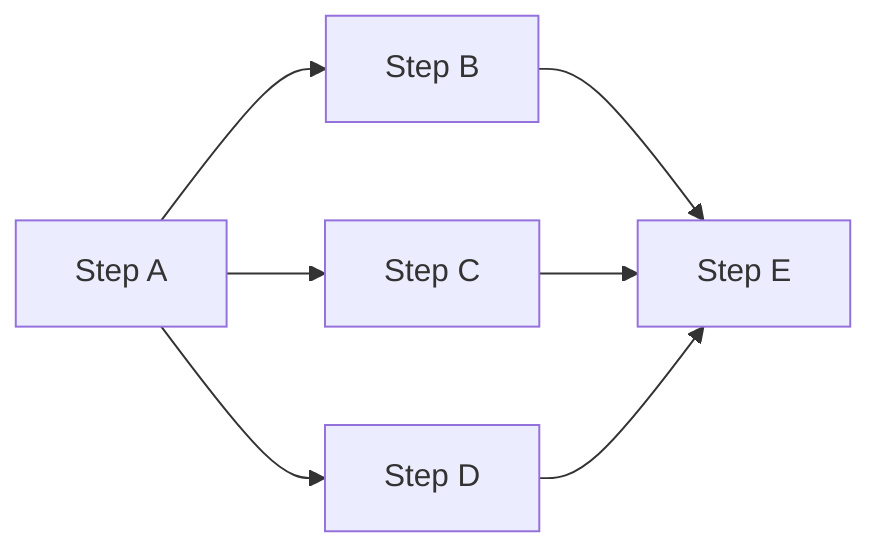

AI work is the combination of inputs, instructions, capabilities, workflow logic, and expected outputs required to produce an outcome. Developers, AI agents, or both can create it.

LoomLoom treats AI work the way a traditional compiler treats source code:

```text
source AI work
  → inspect and validate
  → compile into reusable AI work IR
  → optimize dependencies and model use
  → execute through a compatible runtime
  → package as a SkillBot when distribution is needed
```

## Why use an intermediate representation

Reusable AI work IR makes execution behavior explicit and versionable. It can describe:

- typed inputs and expected outputs;
- workflow steps and dependencies;
- safe sequential and parallel execution;
- model and tool assignments;
- validation, quality, retry, and failure policies;
- execution constraints and final artifacts.

Because dependencies are explicit, the runtime can execute independent steps together without starting downstream work before its required inputs exist.



## From template to SkillBot

```text
Private template
└─ immutable template version
   └─ compiled execution snapshot
      └─ reviewed Listing Version
         └─ available as a SkillBot
```

A SkillBot is a deployable, modular AI system. The source private template remains private and can continue evolving; a published SkillBot changes only through a new reviewed version.

## What structure adds

| Need | LoomLoom approach |
| --- | --- |
| Reusable definition | Versioned TemplateSpec and typed AI work IR |
| Early error detection | Workbook validation before submission |
| Cost visibility | A precheck or Market quote before a paid run |
| Execution tracking | A run ID with status and row-level results |
| Distribution | Immutable SkillBot versions and local Agent Skill wrappers |
| File output | Result workbooks and downloadable artifacts |

Not every AI interaction needs compilation. A one-off prompt remains useful for exploration. Use LoomLoom when the work needs reusable structure, explicit execution semantics, versioning, visibility, or distribution.

<Tip>
  Start with an [official template](/documentation/loomloom/official-templates), or [create reusable AI work IR](/documentation/loomloom/private-templates) when the existing workflow does not match your process.
</Tip>
